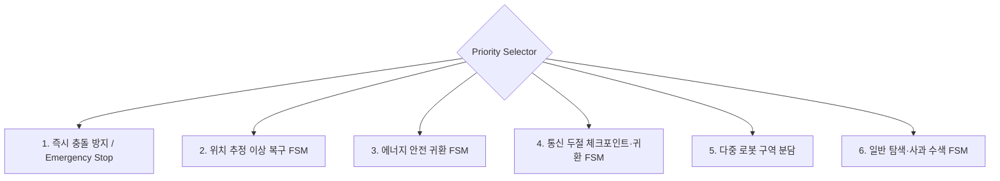
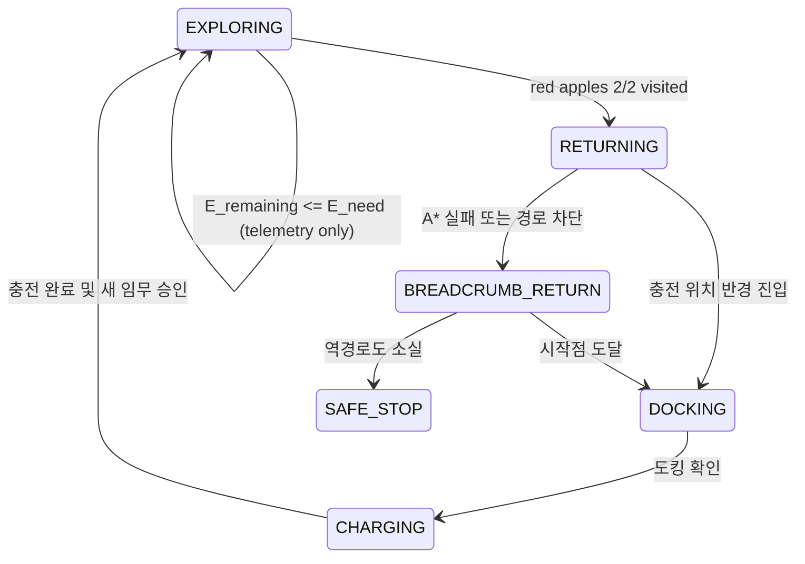
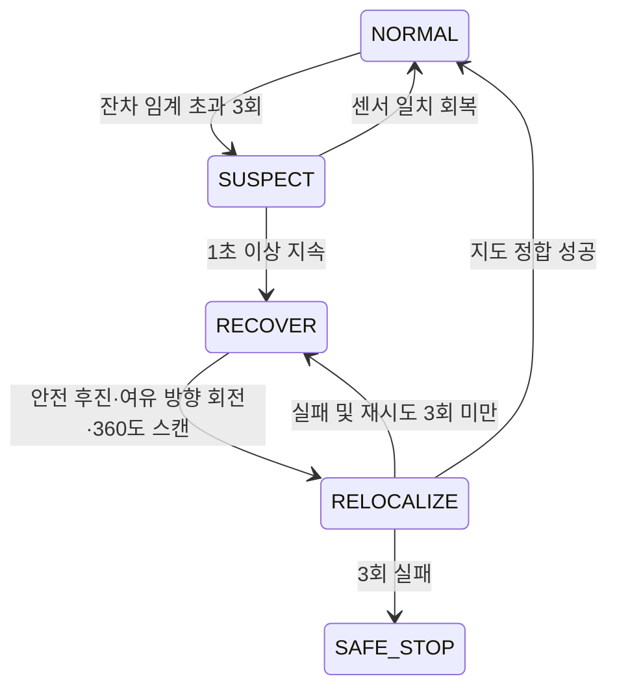
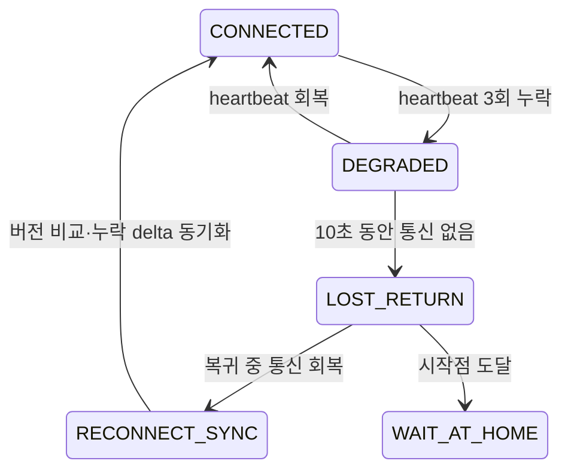
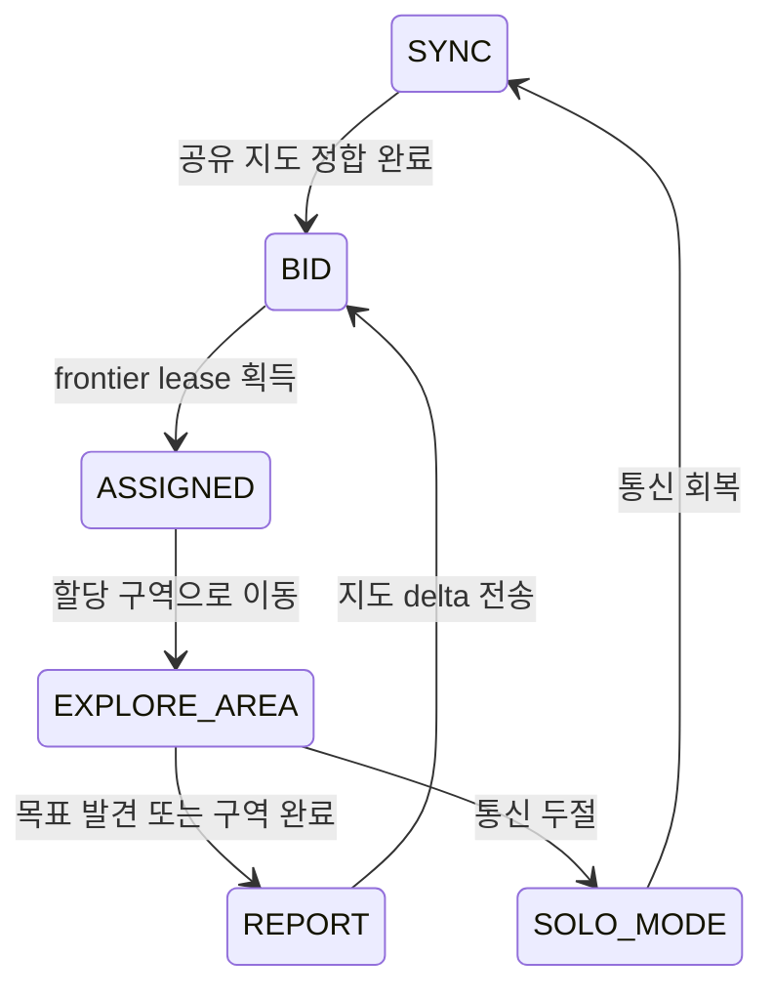

<br>

<h1 align="center">
  2026 부산대학교 TECH WEEK:<br>
  Autonomous Mobile Robot의 Search & Rescue Mission
</h1>
<br>

---

# SAR Pipeline

원본 저장소의 Webots 환경(TurtleBot3 Burger + apartment/breakroom 월드) 위에서
**Search & Rescue 미션을 자율 수행하는 파이프라인** 구현 브랜치입니다.

> **미션**: 사전 지도 없이 미지의 환경을 탐색 → **빨간 사과 2개를 각각
> 탐지·접근** → 시작 지점으로 복귀. 정적 장애물·이동 보행자와 충돌 금지.

## 실행 방법

### 준비 (1회)

```bash
# Python 3.10+ (개발은 3.12, 코드는 3.10 호환 문법만 사용)
python3 -m venv .venv
.venv/bin/pip install -r requirements.txt        # numpy, matplotlib, ultralytics
```

`controllers/sar_controller/runtime.ini` 의 파이썬 경로를 **자기 머신의
venv 경로**로 수정 (Webots가 컨트롤러를 그 파이썬으로 실행):

```ini
[python]
COMMAND = /절대경로/.venv/bin/python
```

### Webots 실행 (아파트 2사과 미션)

```bash
webots worlds/apartment_sar.wbt        # 실시간 GUI
# 헤드리스: webots --batch --mode=fast --minimize --no-rendering worlds/apartment_sar.wbt
```

- 미션 파라미터는 `config_override.json` (시작 포즈, 목표 색/개수, YOLO on/off)
- 실시간 화면: `live_view.html` 을 브라우저로 열면 SLAM 지도와 카메라/YOLO
  화면이 나란히 약 1.5초마다 갱신됨. 목표 확정 순간의 카메라 프레임은
  `out/found_frame.png`에 저장됨. Webots 안에서 자동으로 열리지는 않음
- 연습용 소형 월드: `worlds/practice_arena.wbt`

### Webots 없이 검증 (오프라인 시뮬레이터)

```bash
.venv/bin/python run_tests.py                    # 단위 테스트 (19개)
.venv/bin/python sim_offline.py --scenario rooms_two   # 2사과 E2E 미션
.venv/bin/python sim_offline.py --sweep          # 6개 지형 × 사람 × 시드 매트릭스
.venv/bin/python sim_offline.py --snapshots      # out/에 지도 PNG 저장
```

## 아키텍처

```
센서 → PoseEstimator(인코더+컴퍼스 캘리브레이션) → OccupancyGrid(동적 빔 제외)
     → YOLO apple(47)/dining table(60) 의미 인식
     → 사과 박스 내부 HSV 빨강 검증 / 테이블 다리 사이 가상장애물 생성
     → 위치 추정(LiDAR 일관성/단안 폴백)
     → Mission 상태기계(SPIN→EXPLORE→SEEK→GOTO→…→RETURN)
     → A*(사람 캡슐·영토 페널티) + pure pursuit → 정적 안전 클램프 → (v, ω)
```

| 모듈 | 역할 |
|---|---|
| `sar/config.py` | 모든 튜너블 — **당일엔 사실상 이 파일만 수정** |
| `sar/odometry.py` | 차동구동 odometry + Webots 컴퍼스 부호 보정·오프셋 캘리브레이션 |
| `sar/mapping.py` | log-odds Occupancy Grid (벡터화, 동적 빔 제외 통합) |
| `sar/detection.py` | YOLO apple(47) 우선 탐지 + 박스 내부 HSV 빨강 검증 + 단안 거리 |
| `sar/semantic_obstacles.py` | YOLO 테이블 박스 + LiDAR 다리 결합, 우회용 가상 장벽 생성 |
| `sar/exploration.py` | frontier 클러스터·점수화(사람 방향 후순위)·관성·블랙리스트 |
| `sar/planning.py` | A*(코너컷 금지·예측 캡슐 페널티) + 추종 + 충돌 코리도 안전 클램프 |
| `sar/state_machine.py` | 다중 목표 미션 로직 + 동적 장애물 분류 + recovery |
| `controllers/sar_controller/robot_io.py` | Webots API 격리층 (디바이스 자동탐색·자동캘리브레이션) |
| `sim_offline.py` | Webots 없는 E2E 가상 시뮬레이터 + 시나리오 스윕 하네스 |

## 핵심 설계 결정 (실측 근거)

1. **사과는 LiDAR에 안 보인다** — 반경 5cm 사과는 LDS-01 스캔 평면(~17cm)
   아래. 거리 추정은 **blob 크기 기반 단안**이 주력, LiDAR는 "그 거리면
   blob이 이 크기여야 함" 일관성 검사 통과 시에만 사용.
2. **Webots 컴퍼스는 부호가 반대다** — 컴퍼스는 북쪽 벡터를 로봇 프레임에서
   반환하므로 `atan2(v[1],v[0]) = 북쪽각 − θ` (기울기 −1). 부호 반전 후
   시작 헤딩(제공값)으로 오프셋 캘리브레이션. *(멀티에이전트 리뷰가 발견,
   codex 교차검증 — 시뮬레이션으로는 탐지 불가능한 결함이었음)*
3. **YOLO 우선 + 색상 후검증** — 한 번의 추론으로 COCO `apple(47)`과
   `dining table(60)`을 탐지한다. apple 박스 안에 빨간 HSV 픽셀이 충분하고
   크기·위치·종횡비·채움비 게이트까지 통과해야 최종 빨간 사과 후보가 된다.
   `use_yolo=true`인데 모델을 로드하지 못하면 HSV 단독으로 우회하지 않고
   탐지를 비활성화해 빨간 캔 등의 오탐을 막는다.
4. **가려진 사과 대응 2단계 게이트** — 탐지 단계는 느슨(반달형도 SEEK 추적),
   **위치 확정은 온전한 원형일 때만**(가림 상태의 단안 거리는 2배 오차).
5. **이동 보행자 스택** — §"움직이는 장애물" 참고. 사람이 로봇보다 빠를
   수 있다는 전제의 조기 양보/커밋/탈출 + 경로 차원의 예측 회피.
6. **문 통과** — 각도 부채꼴이 아닌 **충돌 코리도**(진행 폭 안의 물체만)
   판정 + 정지 히스테리시스 + 조향-속도 연동 + 명령 슬루 제한
   (Nav2 RPP/velocity smoother 문헌 기반).

## 움직이는 장애물(보행자) 처리 방식

1. **분류**: LiDAR 빔 끝점이 "이미 확실히 빈공간으로 알던 셀"(log-odds<−1.2,
   벽 이웃 아님)에 찍히면 동적 → 위치 연속성(직전 사람 위치 0.45m 내)으로 보강
2. **지도 보호**: 동적 빔은 지도에 통합하지 않음 (사람 잔상이 지도를
   오염시키면 분류 자체가 무너지는 악순환 차단)
3. **추정**: 좁은 각도 클러스터(≥3빔)의 중심 = 위치, 0.7s 창 차분 = 속도
4. **경로 차원 회피**: A*에 사람 캡슐(현위치+속도×2.5s 쓸기) + 영토(다녀간
   자리) 페널티 → 경로가 애초에 사람 동선을 피해 나감. frontier 점수도
   사람 방향 후순위 (반대쪽부터 탐색)
5. **반응 차원 회피**: 접근 중이면 조기 양보(0.95m) → 멀어지면 커밋 창으로
   전속 횡단 → 근접(0.5m) 시 사람 속도벡터 기준 "선로 수직 이탈"(여유
   공간 점수화) → 초근접 실명 래치. 비껴가는 궤적(miss-distance>0.5m)은
   양보 없이 통과. **모든 동적 제안 위에 정적 안전 클램프가 최종 적용**

## 창의성: 회복 탄력적 자율주행 시스템

이 프로젝트의 창의성은 새로운 동작을 많이 추가하는 것보다, 센서·통신·전력에
문제가 생겨도 **안전하게 성능을 낮추고, 상태를 보존하고, 스스로 복구하거나
귀환하는 비기능적 신뢰성**에 초점을 둔다. 강사 자료의 FSM과 Behavior Tree
구조를 결합해 안전 기능이 일반 탐색보다 항상 높은 우선순위를 갖게 한다.

### 전체 의사결정 구조

목표 구조의 상위 계층은 매 제어 주기마다 무거운 계획을 다시 계산하지 않는다.
2 Hz의 가벼운 Supervisor가 이미 계산해 둔 상태값만 검사하고, 상태 전이나
경로 무효화 이벤트가 발생했을 때만 지도 저장·A*·지도 병합을 실행한다.
현재 단일 로봇 구현도 배터리 조건 자체는 제어 루프에서 빠르게 검사하지만,
A*는 계획 주기와 경로 무효화 조건으로 제한되어 매 틱 다시 계산하지 않는다.



- **Selector**: 위에서부터 조건을 검사해 가장 높은 우선순위의 한 동작만 실행
- **Sequence**: 선택된 복구 절차는 `정지 → 진단 → 복구 → 검증 → 재개` 순서
- **Recovery/Fallback**: A* 실패 시 breadcrumb, 재위치추정 실패 시 안전 정지
- **현재 2사과 미션 규칙**: 저전력 추정치는 상태 표시용으로만 유지하며,
  빨간 사과 2개를 모두 방문하기 전에는 귀환 상태로 전환하지 않음

### 1. 거리·위험도 기반 에너지 추정 (현재 조기 귀환 비활성)

아래 에너지 모델과 귀환 필요량 계산 코드는 남아 있지만, 현재 대회용 설정과
미션 상태기계에서는 조기 귀환 판단에 사용하지 않는다. 사과 2개를 모두 찾은
뒤에만 시작 위치로 복귀한다.

```text
E_need = α × L_home + β × Θ_home + E_compute + E_reserve
참고용 필요량: E_need = E_remaining과 비교 가능 (현재 RETURN 전이에는 미사용)
```

- `L_home`: 캐시된 A* 귀환 경로 길이. 경로가 없으면 통과가 검증된 breadcrumb
  역경로 길이를 사용
- `Θ_home`: 예상 회전량. 제자리 회전이 많은 좁은 공간의 추가 소비 반영
- `E_reserve`: 사람 회피·재계획·센서 오차를 위한 고정 안전 여유
- 실제 배터리 API가 없을 때는 이동 거리와 회전량으로 잔량을 추정하고, 실제
  센서가 있으면 EMA 저역통과 필터를 거친 전압/잔량 값으로 교체



**계산 부하 제어**

- 배터리 필터와 임계식은 2 Hz Supervisor에서 O(1)로 계산
- 매 주기 A*를 실행하지 않고 마지막 귀환 경로와 비용을 캐시
- 다음 이벤트에서만 귀환 경로 재계산:
  `RETURNING 진입`, 경로 위 새 장애물, 경로 이탈 0.3 m 초과,
  1.2초 이상 정지, 또는 5초 watchdog 만료
- `E_remaining - E_need`에 히스테리시스를 적용해 임계값 부근에서
  `EXPLORE ↔ RETURN` 상태가 반복되는 것을 방지
- 현재 구현은 거리·회전 소비 모델과 reserve 계산을 텔레메트리로만 남긴다.
  실제 복귀는 목표 2개 완료 뒤 A*와 breadcrumb 폴백으로 수행한다.

### 2. 바퀴 헛돎·위치 추정 이상 감지와 복구

바퀴 인코더만 보면 로봇이 벽에 걸려 바퀴만 돌아도 이동했다고 판단할 수 있다.
따라서 명령, 인코더, 컴퍼스, LiDAR scan matching의 서로 다른 관측을 비교한다.

| 감시 항목 | 이상 판정 예시 |
|---|---|
| 구동 명령-인코더 | 이동 명령 중인데 바퀴 회전량이 거의 없으면 모터 정지/걸림 |
| 인코더-LiDAR | 인코더 이동량과 scan matching 이동량 차이가 1초 동안 0.08 m 초과하면 헛돎 |
| 인코더-컴퍼스 | 회전량의 방향 또는 크기가 반복해서 불일치하면 한쪽 바퀴 미끄러짐 |
| 지도 innovation | 예상 위치에서 얻을 수 없는 LiDAR 패턴이 연속 3회 발생하면 위치 추정 이상 |



**복구 절차**

1. 즉시 정지하고 현재 지도와 마지막 정상 pose를 체크포인트로 저장
2. 이상 상태 동안 잘못된 pose로 지도가 오염되지 않도록 SLAM 지도 갱신 중지
3. 후방 LiDAR 여유가 있으면 마지막으로 검증된 breadcrumb 방향으로 후퇴
4. 후방이 막혔으면 좌·우 여유를 비교해 넓은 방향으로 회전
5. 360도 LiDAR 스캔을 기존 지역 지도와 정합해 pose를 재설정
6. 기존 목표가 여전히 유효하면 강제 재계획, 아니면 새 frontier 선택

현재 구현은 이동 정체 감지, 후방 안전 확인, 후진·회전·재계획까지 포함한다.
인코더-LiDAR 잔차와 scan matching 기반 재위치추정은 다음 확장 단계다.

### 3. 통신 두절 시 원자적 지도 저장과 자율 복귀

통신 단절을 단순 정지로 처리하면 로봇과 수집한 지도를 모두 잃을 수 있다.
로봇은 heartbeat 상태와 무관하게 로컬 SLAM·장애물 회피·귀환을 수행할 수
있어야 하며, 통신이 끊기면 최신 임무 상태를 보존한 뒤 자율 복귀한다.



**저장 데이터와 부하 제어**

- 저장 항목: occupancy grid 버전, pose와 공분산, breadcrumb, 방문한 목표,
  현재 FSM 상태, 배터리, 할당 구역, 마지막 통신 시각
- 매 프레임 전체 지도를 저장하지 않고 `10초 경과`, `지도 2% 이상 변경`,
  `상태 전이`, `DEGRADED 진입` 이벤트에만 dirty tile을 저장
- 임시 파일에 먼저 기록하고 checksum 검증 후 atomic rename하여 저장 도중
  전원이 끊겨도 이전 체크포인트가 손상되지 않게 함
- `LOST_RETURN` 진입 시 고대역폭 영상 전송과 지도 공유는 중단하고 센서,
  제어, 체크포인트, 귀환 계획에 계산 자원을 우선 배정
- A* 귀환이 실패하면 breadcrumb 역추적, 둘 다 실패하면 충돌 위험이 없는
  위치에서 정지하고 주기적으로 저대역폭 구조 신호만 전송

### 4. 다중 로봇 지도 공유와 탐색 구역 분담

여러 로봇이 전체 센서 데이터를 계속 방송하면 네트워크와 CPU를 낭비하고 같은
방을 중복 탐색하게 된다. 각 로봇은 독립적으로 주행 가능한 로컬 지도를 유지하고,
변경된 submap과 frontier 후보만 저주기로 공유한다.



**지도 공유**

- 공통 시작 좌표가 있으면 그 좌표계를 사용하고, 없으면 공통 landmark 또는
  submap scan matching으로 로봇 간 변환행렬을 추정
- 원본 LiDAR를 보내지 않고 `(robot_id, tile_id, version, timestamp,
  log_odds, confidence)` 형태의 변경 tile만 압축 전송
- 더 오래된 version은 버리고, 동적 장애물 셀은 공유 지도에 합치지 않으며,
  동일 셀은 신뢰도 가중 log-odds로 병합
- 기본 전송 주기는 2초지만 지도 변경이 없으면 전송하지 않는다.

**탐색 구역 분담**

각 frontier 클러스터에 대해 로봇별 입찰 비용을 계산한다.

```text
bid = path_cost + risk_cost + battery_cost + overlap_cost - information_gain
```

- 가장 낮은 bid의 로봇이 해당 frontier의 일정 시간 lease를 획득
- 다른 로봇은 lease가 살아 있는 frontier를 후보에서 제외해 중복 탐색 방지
- 담당 로봇 heartbeat가 끊기거나 lease가 만료되면 자동으로 재입찰
- 중앙 서버가 있으면 전체 최적 할당을 사용하고, 서버가 없으면
  `낮은 bid → 낮은 robot_id` 순서의 결정론적 분산 경매로 동일한 결과 유지
- 배터리가 낮은 로봇은 `battery_cost`가 커져 가까운 구역만 담당하고,
  귀환 FSM이 발동하면 모든 lease를 즉시 반납

### 구현 단계와 검증 기준

| 항목 | 현재 단계 | 완료 판정 기준 |
|---|---|---|
| 에너지 추정 | 거리 모델·reserve 계산만 유지, 조기 귀환 비활성 | 목표 2개 완료 전 RETURN 전이 0회 |
| 헛돎·위치 이상 | 정체 감지·안전 복구 구현, scan matching 확장 예정 | 헛돎 주입 후 3초 내 감지, 3회 내 복구 또는 안전 정지 |
| 통신 두절 대응 | 인터페이스·FSM 설계 | 10초 단절 시 체크포인트 보존 후 외부 명령 없이 귀환 |
| 다중 로봇 협업 | submap/경매 프로토콜 설계 | 중복 탐색률 감소, 로봇 이탈 시 lease 자동 재분배 |

공통 비기능 요구사항은 **안전 우선순위 위반 0회**, 제어 루프를 막는 동기식
I/O 금지, A*·지도 병합의 이벤트 기반 실행, 모든 상태 전이와 실패 원인의
타임스탬프 로그 기록이다. 이를 통해 기능 성공률뿐 아니라 안전성, 가용성,
복구 가능성, 계산 효율, 확장성을 평가할 수 있다.

## 검증 상태

- **오프라인 스윕**: 6개 지형(방·2사과·복도·개방·미로) × 사람(실측 0.2m/s)
  유무 × 시드 — 게이트 전 케이스 **무충돌**, 2사과 시나리오 완주
  (사람 케이스 일부는 안전 우선으로 느림)
- **Webots 실전**: 기존 HSV 우선 버전으로 apartment/practice_arena 완주 이력.
  현재 YOLO 우선 변경분은 실제 Webots 카메라 화면으로 재검증 필요
- **품질 공정**: 오프라인 스윕으로 회귀 검증 → 멀티에이전트 적대 리뷰
  (23 에이전트, 치명 결함 3건 발견) → codex 교차검증 → 실기 스모크

## 당일 체크리스트

`docs/DAY_OF_CHECKLIST.md` — 계획안 준수 매트릭스, LiDAR 방향 30초 검증,
HSV 보정 절차, 흔한 증상→원인 표, 제출 전 동결 절차.

## 알려진 한계

- 로봇(0.21m/s)보다 2배 빠른 왕복 차단자는 물리적으로 회피 보장 불가
  (스트레스 케이스로만 유지 — 실전 보행자는 0.2m/s)
- 기본 YOLO11n이 Webots 사과 렌더를 COCO `apple`로 잡는지는 당일 실제
  카메라 화면에서 확인 필요. 미검출이면 제공 모델/커스텀 가중치로 교체
- green 사과는 텍스처 기반이라 HSV 범위가 넓음 — 당일 실화면 보정 필요
- 목표가 책상 위에 있는 규칙이면 "수평선 위 기각" 게이트 완화 필요
